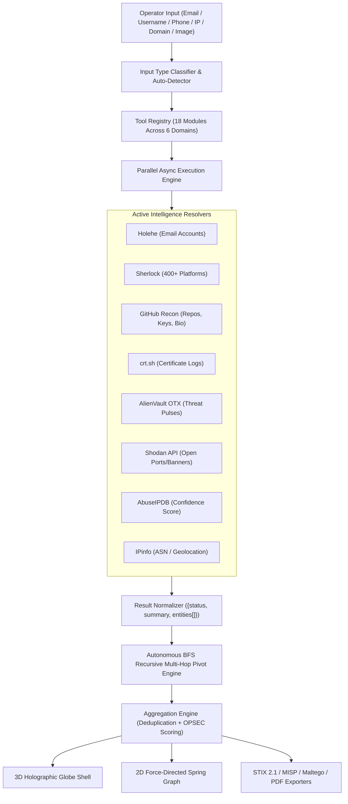

# TraceMesh // Autonomous OSINT Aggregation & Correlation Platform

<div align="center">

```
  ████████╗██████╗  █████╗  ██████╗███████╗███╗   ███╗███████╗███████╗██╗  ██╗
  ╚══██╔══╝██╔══██╗██╔══██╗██╔════╝██╔════╝████╗ ████║██╔════╝██╔════╝██║  ██║
     ██║   ██████╔╝███████║██║     █████╗  ██╔████╔██║█████╗  ███████╗███████║
     ██║   ██╔══██╗██╔══██║██║     ██╔══╝  ██║╚██╔╝██║██╔══╝  ╚════██║██╔══██║
     ██║   ██║  ██║██║  ██║╚██████╗███████╗██║ ╚═╝ ██║███████╗███████║██║  ██║
     ╚═╝   ╚═╝  ╚═╝╚═╝  ╚═╝ ╚═════╝╚══════╝╚═╝     ╚═╝╚══════╝╚══════╝╚═╝  ╚═╝
```

**Next-Gen Tactical OSINT Command-Center HUD • Dual-Mode 3D/2D Graph Engine • Autonomous Multi-Hop Pivoting**

[](https://nextjs.org/)
[](https://nestjs.com/)
[](https://threejs.org/)
[](https://www.typescriptlang.org/)
[](https://tailwindcss.com/)
[](LICENSE)

[Live Dashboard](http://localhost:3000) • [Architecture](#-architecture) • [Features](#-key-features) • [Quickstart](#-quickstart) • [Export Formats](#-threat-intelligence-exporters)

</div>

---

## 🛰️ Overview

**TraceMesh** is an open-source intelligence (OSINT) tool-aggregator and reconnaissance command-center. It solves the fragmentation problem of modern cyber intelligence by unifying dozens of specialized reconnaissance tools into a single input box with parallel execution, unified schema normalization, automated multi-hop recursive pivoting, and interactive 3D holographic entity correlation.

---

## ⚡ Key Features

- 🌐 **Dual-Mode Visualizer**: Seamlessly toggle between a **3D Holographic Constellation Globe** (with rotating latitude rings and polar satellites) and a **2D Tactical Force-Directed Spring Physics Graph**.
- 🔄 **Autonomous Multi-Hop Recursive Recon (Phase 20)**: BFS recursive crawler that automatically discovers and pivots across linked usernames, domains, and IPs up to 3 hops deep.
- 🛡️ **Live OPSEC Data Redaction (Hotkey `R`)**: Real-time PII data masking for emails (`t***n@c***y.com`), IPs (`192.168.*.*`), phone numbers, and credentials during screen recordings, live demos, or audits.
- 🎛️ **Sci-Fi Command-Center HUD**: Precision dark-control-room interface featuring procedural scanlines, UTC mission clock, frequency audio spectrum visualizer, 3D card parallax tilt, and matrix character scramble decryption.
- 🎨 **Tactical Palette Switcher**: 4 high-contrast HUD themes (Cyber Cyan, Amber Alert, Emerald Recon, Phantom Purple) with real-time CSS variable morphing.
- 💼 **Tactical Case Manager**: Dossier drawer with target evidence pinboard, investigator notes, and case export capabilities.
- 📊 **Multi-Target Comparison Matrix**: Cross-correlation matrix highlighting intersection pivots, shared subnets, and overlap entities across distinct targets.
- 🔊 **Procedural Web Audio Synthesizer**: Zero-dependency Web Audio API oscillator sound engine for terminal telemetry blips, radar lock-on alerts, and critical breach alarms.
- 📄 **Enterprise Threat Exporters**: Export investigation intelligence into **STIX 2.1 Bundles**, **MISP Events**, **Maltego Graph CSVs**, **Printable PDF Dossiers**, and raw JSON/CSV tables.

---

## 🏗️ Architecture & Data Flow



---

## 🛠️ Registered Intelligence Modules

| Module Name | Domain | Execution Type | Target Data / Capabilities |
| :--- | :--- | :--- | :--- |
| **Sherlock** | `username` | Edge / API | Scans 400+ social networks, forums, and developer platforms. |
| **Holehe** | `email` | Edge / API | Probes account registration status across 120+ web services. |
| **GitHub Recon** | `username` | Live API | Live user bio, public repos, organizations, and linked domains. |
| **crt.sh** | `domain` | Live API | Certificate Transparency logs enumerating all issued SSL subdomains. |
| **AlienVault OTX** | `domain` / `ip` | Authenticated API | Threat intelligence pulses, malware samples, and adversary IOCs. |
| **Shodan** | `ip` / `domain` | Authenticated API | Exposed services, open network ports, banner grabs, and device tags. |
| **AbuseIPDB** | `ip` | Authenticated API | IP reputation score, malicious report count, and ISP country routing. |
| **IPinfo** | `ip` / `domain` | Authenticated API | Autonomous System Number (ASN), BGP routes, and city-level coordinates. |
| **DomainRecon** | `domain` | Edge / DNS | DNS DoH records (A, AAAA, MX, TXT, NS) and mail server routing. |
| **PhoneInfoga** | `phone` | Edge / API | International E.164 parsing, carrier identification, and line type. |
| **ExifTool** | `image` | Edge / File | Metadata extraction (GPS coordinates, camera model, timestamps). |
| **Maigret** | `username` | Edge / API | Deep recursive username search with regex matching. |
| **h8mail** | `email` | Edge / Breach | Plaintext breach checking and credential leak identification. |
| **Subfinder** | `domain` | Edge / API | Fast passive subdomain enumeration and asset discovery. |
| **SpiderFoot** | `multi-domain` | Edge / API | Multi-source OSINT correlation and footprinting. |
| **theHarvester** | `email` / `domain` | Edge / API | Search engine scraping for emails, employee names, and subdomains. |
| **Censys** | `ip` / `domain` | Authenticated API | TLS certificate inspection and global IPv4 service enumeration. |
| **Ahmia** | `darknet` | Edge / API | Clearnet indexing of Tor .onion hidden services. |

---

## 🚀 Quickstart

### Prerequisites
- **Node.js**: `v20+` (Recommended: Node 22+)
- **pnpm**: `v9+` or `v10+` (`npm install -g pnpm`)
- **Docker & Compose**: (Optional, for persistent PostgreSQL + Redis)

### Installation & Run

```bash
# 1. Clone repository
git clone https://github.com/qamarabbas-024/TraceMesh.git
cd TraceMesh

# 2. Configure environment
cp .env.example .env

# 3. Install workspace dependencies
pnpm install

# 4. Build all packages
pnpm build

# 5. Launch both API and Web servers concurrently
pnpm dev
```

- **Frontend HUD**: [`http://localhost:3000`](http://localhost:3000)
- **Backend API**: [`http://localhost:3001`](http://localhost:3001)

---

## ⌨️ Tactical Keyboard Shortcuts

| Key | Action | Description |
| :--- | :--- | :--- |
| **`R`** | **OPSEC Redaction** | Instant PII masking for emails, IPs, phone numbers, and credentials. |
| **`C`** | **Case Manager** | Open investigation dossiers drawer and evidence pinboard. |
| **`H`** | **History Drawer** | View and reload past investigation reports from local memory/DB. |
| **`M`** | **Reduce Motion** | Toggle animations, 3D idle rotation, and particle effects. |
| **`S`** | **Audio Mute** | Mute or unmute procedural Web Audio terminal sound effects. |
| **`?`** | **Shortcuts HUD** | Open the tactical command hotkeys cheat sheet modal. |
| **`Esc`** | **Close Modals** | Dismiss any open modal drawer or popover. |

---

## 📄 Threat Intelligence Exporters

TraceMesh exports unified findings directly into enterprise formats:

- **STIX 2.1 JSON**: Standardized Cyber Threat Intelligence objects (`threat-actor`, `indicator`, `infrastructure`, `relationship`).
- **MISP Event JSON**: Compatible with Malware Information Sharing Platform sharing communities.
- **Maltego CSV**: Direct node-and-link transform format for graph visualization in Maltego Desktop.
- **Printable PDF Dossier**: Formatted intelligence report with executive summary, OPSEC score gauge, and discovered entity tables.

---

## 👤 Author & Maintainer

**Qamar Abbas**  
- **GitHub**: [@qamarabbas-024](https://github.com/qamarabbas-024)
- **Project**: [TraceMesh](https://github.com/qamarabbas-024/TraceMesh)

---

## 📜 License

This project is licensed under the **MIT License** - see the [LICENSE](LICENSE) file for details.

<!-- verified-telemetry: 2026-09-06T01:49:27.629423 -->
